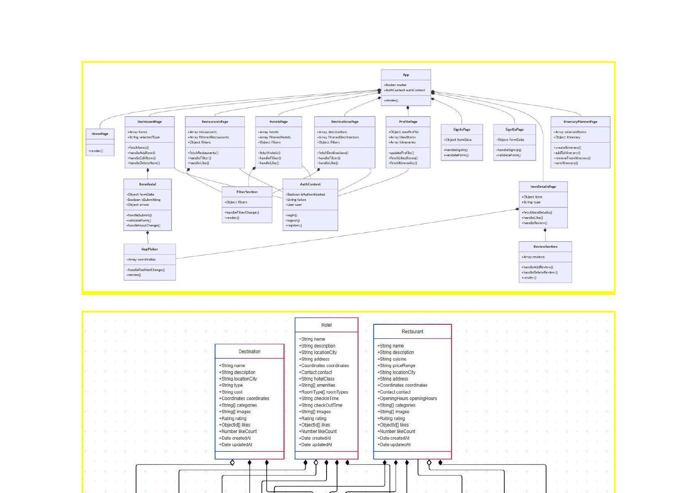
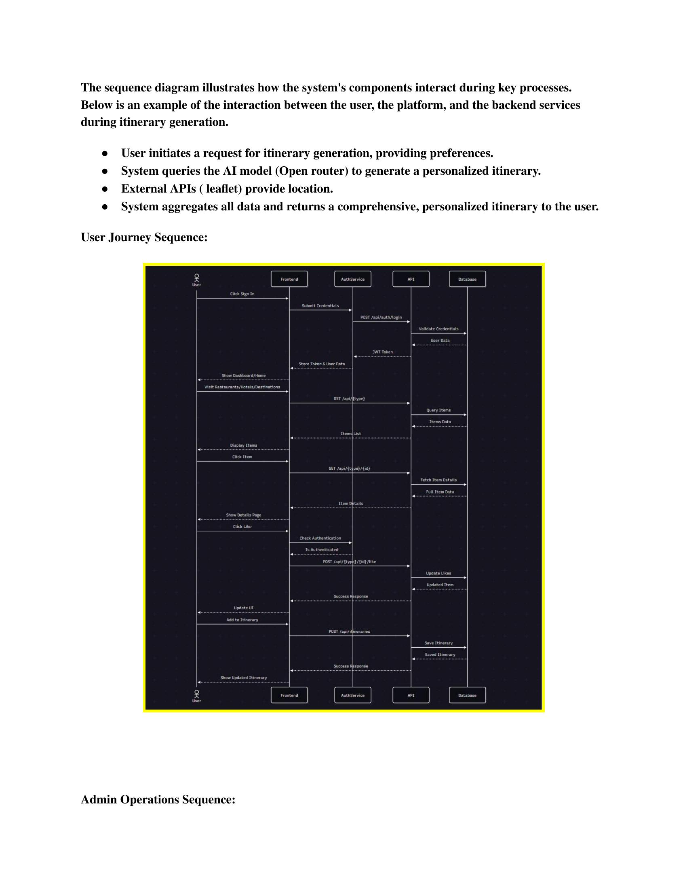
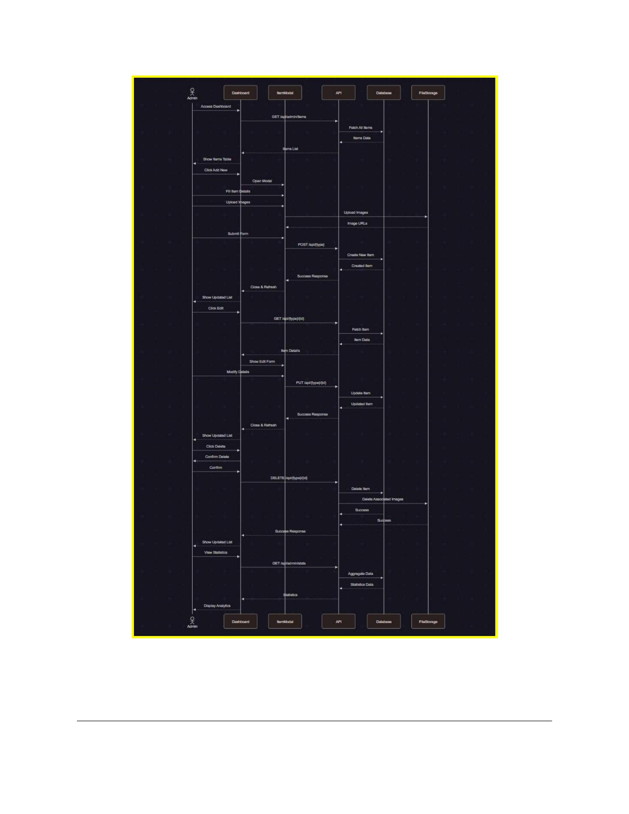
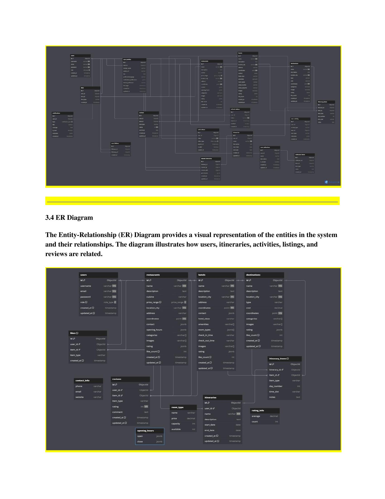
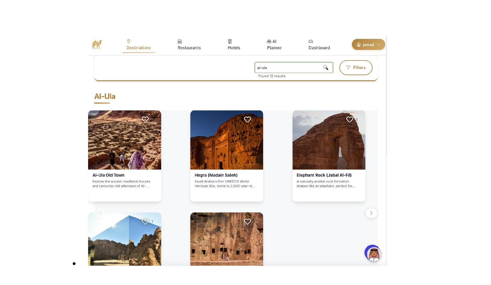
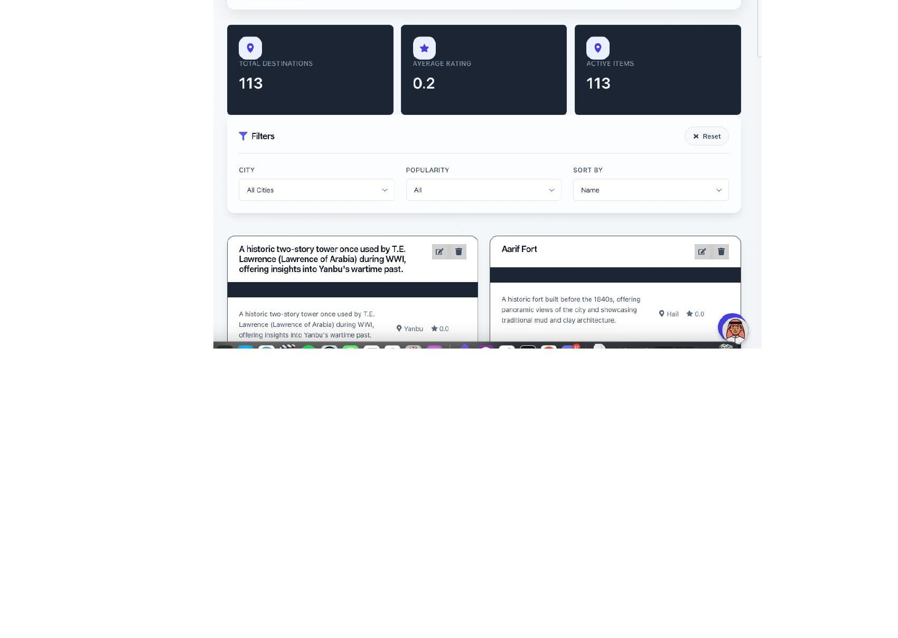
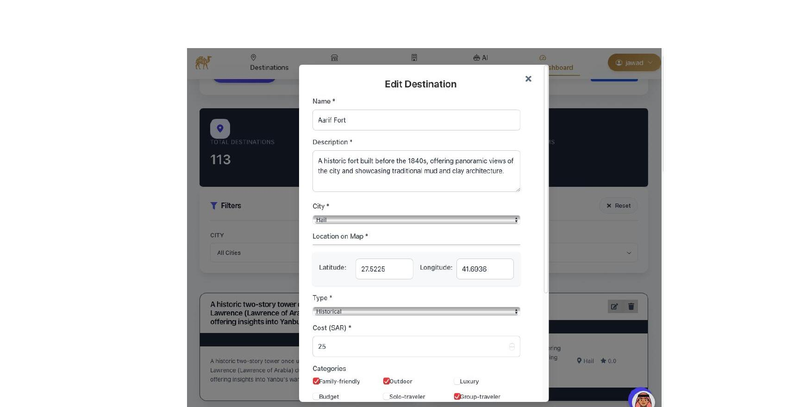
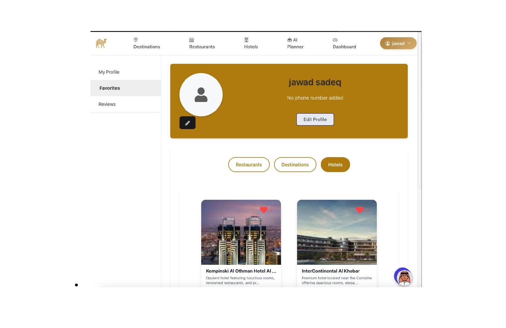
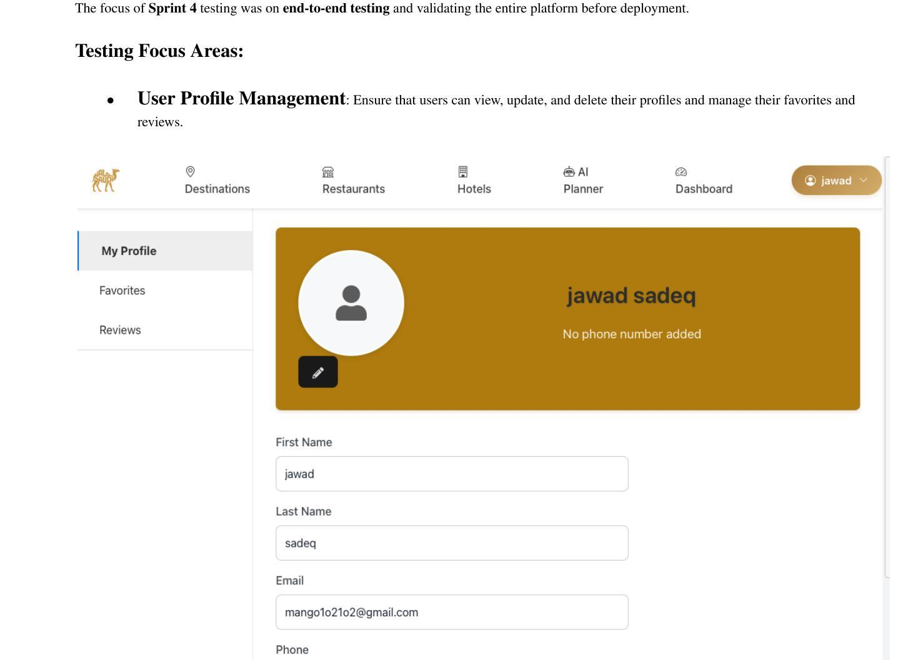

# Hala Saudi _  AI-Powered Tourism Platform


<div align="center">

**A full-stack travel planning platform for Saudi Arabia**
built with React, Node.js, MongoDB, and OpenAI

[](https://reactjs.org/)
[](https://nodejs.org/)
[](https://mongodb.com/)
[](https://openai.com/)
[](https://jwt.io/)

**Developed by Ziyad Alshahrani**
Prince Sultan University - Software Engineering Senior Project
Supervised by Prof. Dr. Eng. Mohammed Akkour

</div>

---

## About This Project

<<<<<<< HEAD
Hala Saudi is a web application I built as my senior project at Prince Sultan University. The idea behind it is to help tourists plan their trips around Saudi Arabia in a smarter way. Instead of searching manually across different websites, users can come to one platform, discover destinations, hotels and restaurants, and let the AI generate a full personalized itinerary for them based on their preferences.
=======
**Ziyad Alshahrani** | Software Engineer
>>>>>>> 5d9d7626721412dacf85f2170e5fac0b009e0f00

The project is built full-stack, and I handled everything from the database design and backend API to the frontend UI and the AI integration. It took 4 sprints over a full academic semester to complete.

---

## What the Platform Does

The core feature is the AI itinerary generator. A user fills in a 6-step form telling the system where they want to go, how long they are staying, what their interests are, their budget, who they are travelling with, and their food preferences. The backend then pulls relevant places from the database, builds a structured prompt, sends it to OpenAI, and gets back a complete day-by-day plan with a hotel recommendation and morning, lunch, afternoon, and dinner suggestions for each day.

Beyond the itinerary feature, the platform lets users browse and filter destinations, hotels and restaurants, like and save their favourites, leave ratings and reviews, search across everything from one search bar, and manage their profile with a photo upload. There is also a full admin dashboard where administrators can add, edit and delete any listing in the system.

---

## Features

| Feature | Description |
|---------|-------------|
| 🤖 AI Itinerary Generator | Personalized day-by-day travel plans powered by OpenAI |
| 🗺️ Destination Discovery | Browse and filter Saudi destinations with interactive maps |
| 🏨 Hotels | Search by price range, amenities and hotel class |
| 🍽️ Restaurants | Filter by cuisine, category and price range |
| ⭐ Ratings and Reviews | Star ratings with score breakdown for all listings |
| ❤️ Likes and Favorites | Save and manage favourites across all listing types |
| 🔍 Global Search | Search across all content from one search bar |
| 🔐 Auth System | JWT with HTTP-only cookies, email verification and password reset |
| 👤 User Profiles | Photo upload, favourites tab and review history |
| 🛡️ Admin Dashboard | Full CRUD management with stats and role-based access |
| 🔔 Notifications | Real-time toast notifications for user actions |
| 🧪 Test Suite | Unit, integration and black-box tests across the whole app |

---

## Built Across 4 Sprints

| Sprint | What Was Delivered |
|--------|--------------------|
| Sprint 1 | System architecture, MVC design, database schema, security requirements |
| Sprint 2 | Admin dashboard, CRUD for destinations, hotels and restaurants, filtering and sorting |
| Sprint 3 | Ratings and reviews, likes and favourites, global search, real-time notifications |
| Sprint 4 | User profile management, search optimization, end-to-end testing, deployment |

---

## Tech Stack

### Frontend
| Technology | Purpose |
|-----------|---------|
| React 18 + Vite | SPA framework and build tool |
| React Router v6 | Client-side routing |
| Framer Motion | UI animations |
| Leaflet / React-Leaflet | Interactive maps |
| Axios | HTTP client |
| Bootstrap 5 + CSS | Responsive UI |
| react-toastify | Real-time notifications |
| Vitest + React Testing Library | Frontend testing |

### Backend
| Technology | Purpose |
|-----------|---------|
| Node.js + Express.js | REST API server using MVC pattern |
| MongoDB + Mongoose | NoSQL database and ODM |
| JWT + bcryptjs | Authentication and password hashing |
| OpenAI API | AI itinerary generation |
| Multer | File and image uploads |
| Nodemailer | Email for password reset and verification |
| express-rate-limit | API rate limiting |
| xss | Input sanitization |
| Jest + Supertest + mongodb-memory-server | Backend testing |

---

## Project Structure

```
hala-saudi/
├── frontend/
│   └── src/
│       ├── pages/
│       │   ├── Home/
│       │   ├── Destinations/
│       │   ├── Hotels/
│       │   ├── Restaurants/
│       │   ├── ItineraryPlanner/     # AI wizard with 6-step form
│       │   ├── Dashboard/            # Admin panel with CRUD and stats
│       │   ├── Profile/
│       │   ├── ItemDetails/
│       │   ├── SearchAll/
│       │   └── SignIn / SignUp / ResetPassword
│       ├── components/
│       │   ├── ItineraryPlanner/
│       │   ├── Rating/
│       │   ├── LikeButton/
│       │   ├── FilterPanel/
│       │   └── LocationMap/
│       └── context/                  # AuthContext, ItineraryContext
│
└── backend/
    ├── Controllers/
    │   ├── itineraryController.js    # AI generation with OpenAI
    │   ├── authController.js
    │   ├── destinationController.js
    │   ├── hotelController.js
    │   ├── restaurantController.js
    │   ├── ratingController.js
    │   ├── likeController.js
    │   ├── profileController.js
    │   └── dashboardController.js
    ├── Models/
    ├── Routes/
    ├── middleware/
    └── tests/
```

---

## How the AI Itinerary Works

The user fills in a 6-step form:

```
Destination -> Duration -> Interests -> Budget -> Travelers -> Food Preferences
```

Then the backend does this:

```js
// itineraryController.js
const [destinations, hotels, restaurants] = await Promise.all([
  Destination.find({ locationCity: destination }),
  Hotel.find({ locationCity: destination }),
  Restaurant.find({ locationCity: destination }),
]);

const prompt = constructPrompt(userData, { destinations, hotels, restaurants });

const completion = await openai.createChatCompletion({
  model: "gpt-3.5-turbo",
  messages: [{ role: "user", content: prompt }]
});

const itinerary = JSON.parse(completion.data.choices[0].message.content);
await Itinerary.create({ user: userId, ...itinerary });
```

The AI only picks from real places in the database, so there are no made-up venues in the results.

---

## Security

| What | How |
|------|-----|
| Authentication | JWT tokens with 24h expiry and a refresh token |
| Passwords | bcrypt with salt factor 10, never stored in plaintext |
| Token storage | HTTP-only cookies, not localStorage |
| CORS | Approved domains only, Secure and SameSite set in production |
| Authorization | Role-based with user and admin roles and middleware guards |
| Input | Validated on both client and server, sanitized against XSS |
| Password reset | Time-limited JWT valid for 1 hour with email verification |
| Rate limiting | Applied on auth routes and other sensitive endpoints |

---

## Testing

```bash
# Backend tests with coverage
cd backend && npm run test:coverage

# Frontend tests with coverage
cd frontend && npm run test:coverage
```

| Area | What is Tested |
|------|---------------|
| authController | Login, register, token validation |
| destinationController | CRUD, filtering, search |
| hotelController | Listing, admin operations |
| restaurantController | CRUD, search |
| likeController | Like and unlike logic |
| itineraryController | AI generation and retrieval |
| authMiddleware | JWT verification and role guard |
| validationMiddleware | XSS and sanitization rules |
| Frontend components | LikeButton, Rating, Auth flows |

All backend tests run against an in-memory MongoDB instance so the real database is never touched.

---

## Getting Started

```bash
git clone https://github.com/Ziyadalshrani507/UNI-Senior-Project-HalaSaudi.git
cd UNI-Senior-Project-HalaSaudi
cd backend && npm install
cd ../frontend && npm install
```

Create a `backend/.env` file:
```env
MONGODB_URI=your_mongodb_uri
JWT_SECRET=your_jwt_secret
PORT=5000
FRONTEND_URL=http://localhost:5173
OPENAI_API_KEY=your_openai_key
EMAIL_USER=your_email
EMAIL_PASS=your_email_password
```

Create a `frontend/.env` file:
```env
VITE_API_URL=http://localhost:5000
```

Then run:
```bash
cd backend && npm run dev
cd frontend && npm run dev
```

The app will be available at `http://localhost:5173`

---

## System Design

### Class Diagram


### User Journey Sequence Diagram


### Admin Operations Sequence Diagram


### ER Diagram


---

## Screenshots

### Destinations - Search and Discovery


### Admin Dashboard


### Admin - Edit Modal


### User Profile - Favorites


### User Profile - Management


---

<div align="center">
  Built by Ziyad Alshahrani<br/>
  Prince Sultan University - Software Engineering - Vision 2030
</div>
